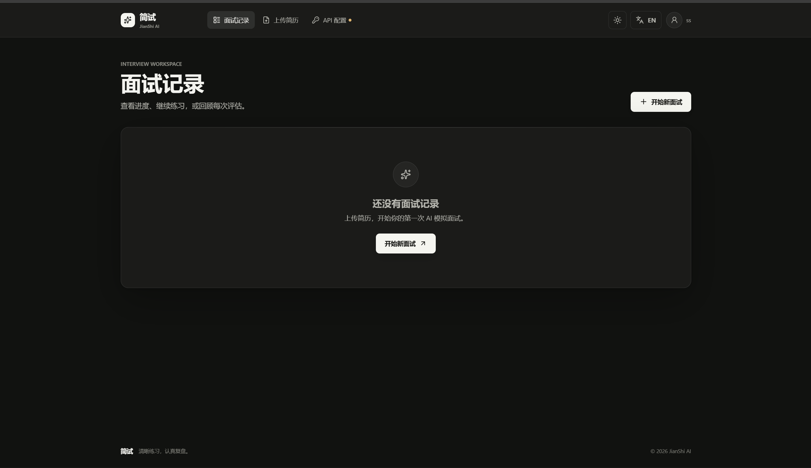
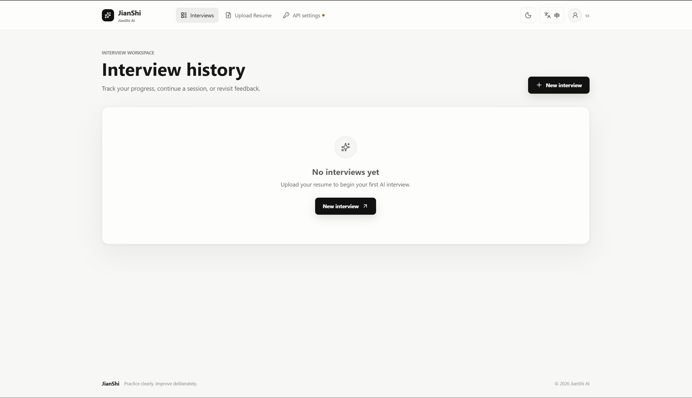
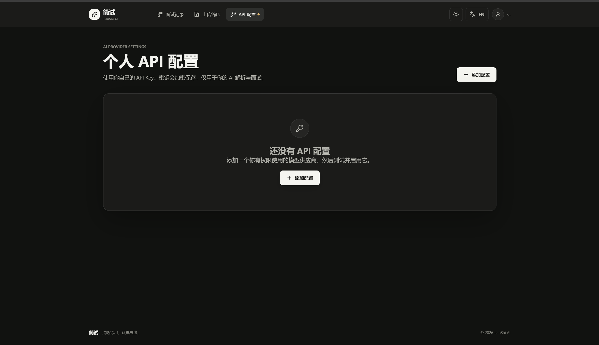
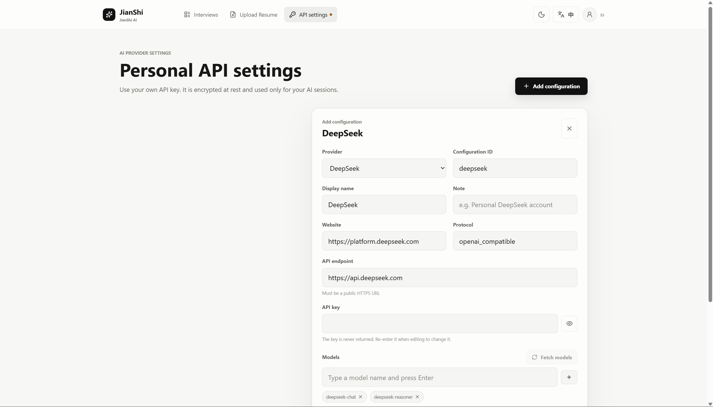

# 简试 JianShi AI

简试是一个面向求职者的 AI 模拟面试平台。用户上传 PDF 简历，选择目标岗位、面试难度和题目数量，系统完成简历分析、问题生成、逐题点评和综合报告。

这个项目的重点不是简单调用一次大模型，而是把 AI 应用需要的完整链路做成可运行的系统：用户身份、个人模型配置、文件处理、异步任务、面试状态、流式响应、数据持久化和后台管理都包含在项目中。

## 在线体验

**👉 打开即用：[https://oi1784105-spec.github.io/Jian-Shi-AI/](https://oi1784105-spec.github.io/Jian-Shi-AI/)**

登录页已经预填演示账号，直接点击「登录」即可走完整流程：

```text
登录 → 工作台（已预置面试记录） → API 配置（已预置 Provider）
     → 上传简历（任意 PDF） → 解析与岗位分析 → 生成面试题
     → 逐题作答 → 流式点评 → 综合评估报告
```

关于在线版需要说明的三点：

- 它是**纯静态演示版**，托管在 GitHub Pages 上，所有数据由浏览器本地生成，**不会调用任何真实模型接口**，也不需要注册或填写 API Key。
- 演示数据保存在浏览器 localStorage 中，随时可以点左下角的「重置演示数据」回到初始状态。
- 想要真实的 AI 能力，请按下方「快速启动」在本地跑起前后端，并在 API 配置页填写自己的模型 Provider。

## 页面预览

| 面试记录 · 黑夜中文 | 面试记录 · 白昼 English |
|---|---|
|  |  |

| API 配置 · 黑夜中文 | API 配置 · 白昼 English |
|---|---|
|  |  |

## 项目定位

传统面试练习通常只有静态题目，无法结合个人简历，也不能在回答后立即给出针对性反馈。简试把简历内容、目标岗位和面试上下文串联起来：

```text
注册 / 登录 → 配置个人 AI Provider → 上传简历
    → 文本提取 → 结构化解析与岗位分析 → 生成面试题
    → 逐题回答 → SSE 流式点评 → 后台生成综合报告
```

## 功能

### 用户端

- 上传 PDF 简历，自动提取文本并识别姓名、学历、技能、经历、项目和概述。
- 根据目标岗位和难度生成面试题，支持简单、中等、困难三档设置。
- 支持 3、5、8 道题的快速、标准和深度模式。
- 通过 SSE 流式接收回答点评和评分，避免等待完整响应时页面无反馈。
- 查看每道题的得分、反馈和最终综合报告，保留历史面试记录。
- 支持中文 / English、白昼 / 黑夜两套主题。

### 个人 AI Provider 配置

- 支持 DeepSeek、OpenAI、Anthropic、Gemini 和通用 OpenAI Compatible Endpoint。
- 支持 Endpoint、模型列表、默认模型、API 版本和备注配置。
- 支持模型发现和连接测试，保存前校验 Endpoint、模型与 API Key。
- API Key 在服务端使用 Fernet 加密保存，查询接口不返回原文。
- 每个用户只能使用自己名下的 Provider；面试会话固定使用创建时的 Provider 和模型。

### 管理端

- 管理员独立登录，查看用户、面试记录和基础运营数据。
- 用户端 API 与管理端 API 分离，分别提供 Swagger 文档和 JWT 鉴权配置。

## 在线演示版是怎么做的

在线版没有后端，却要能完整体验产品，因此前端内置了一个**演示层**（`ai-interview-frontend/src/demo/`），在浏览器里接管全部接口调用。

| 问题 | 做法 |
|---|---|
| 后端跑不了 | FastAPI + PostgreSQL + Redis + Celery 无法托管在 GitHub Pages 上，因此只发布前端静态产物。 |
| 接口怎么来 | 在 **axios adapter** 层拦截：`request.js` 在演示构建下挂载本地适配器，返回后端约定的 `{ code, message, data }` 信封。9 个视图和 5 个 api 模块**一行都没有改动**。 |
| 流式点评怎么做 | 答题接口用的是原生 `fetch` + `ReadableStream`，不走 axios；演示层用 `fetch` 垫片合成 `data: {...}` 事件流，逐字推送点评和评分。 |
| 「解析中」怎么模拟 | 简历解析和报告生成用**时间戳**（`parse_ready_at` / `report_ready_at`）表达异步状态，而不是 setTimeout，因此刷新页面后状态依然正确。 |
| 数据从哪来 | 预置了 1 个已启用 Provider、2 条面试记录（1 条已完成带报告、1 条进行中可继续作答），其余内容在浏览器本地按岗位关键词生成。 |
| 评分怎么算 | 回答越长、命中的技术关键词越多、结构越清晰，得分越高，让「回答质量 → 评分」的因果关系可以被直观看到。 |

演示层的实现分布在 6 个文件里，都不依赖 Vue，可以单独测试：`config` 意义上的入口是 `src/demo/index.js`，核心逻辑在 `store.js`（内存库与业务规则）、`data.js`（内容与生成器）、`adapter.js`（axios 适配器）、`fetch.js`（SSE 流）、`DemoBanner.vue`（演示提示条）。

## 系统架构

```text
用户端 Vue 3 ─┐
              ├─ FastAPI Client API ─ PostgreSQL
管理端 Vue 3 ─┘                    └ Redis / Celery Worker
                                         └ AI Provider Runtime
```

后端采用 Router → Service → Model 分层。Client API 和 Backoffice API 共享 Service 层，但路由、OpenAPI 文档和鉴权边界分开。PostgreSQL 保存用户、简历、面试和消息；Redis 提供缓存与 Celery Broker；AI Provider Runtime 统一不同供应商的调用协议。

### 目录结构

```text
ai-interview/
├── ai-interview-frontend/       # 用户端 Vue 3 + Vite
│   ├── src/views/               # 登录、工作台、简历上传、面试、报告、API 配置、个人中心
│   ├── src/demo/                # 在线演示版的本地模拟层（仅演示构建启用）
│   └── .env.demo                # 演示构建参数：演示模式 + Pages 子路径
├── ai-interview-admin/          # 管理端 Vue 3 + Vite
├── ai-interview-backend/        # FastAPI、模型、迁移和 Docker 配置
│   ├── app/api/                 # Client / Backoffice API 路由
│   ├── app/services/            # 业务服务和 AI 调用封装
│   ├── app/models/              # SQLAlchemy 数据模型
│   ├── app/schemas/             # Pydantic 请求与响应模型
│   ├── app/core/                # 配置、日志、Celery 和安全基础设施
│   └── migrations/              # Alembic 数据库迁移
├── .github/workflows/           # GitHub Pages 自动发布流水线
├── docs/                        # 设计记录和页面截图
├── 部署文档.md
└── README.md
```

## 核心实现

### 简历解析后台化

上传接口先完成文件落盘和数据库记录，立即返回 `parsing` 状态，再使用 FastAPI BackgroundTasks 和独立数据库会话完成 PDF 提取、AI 解析与岗位分析：

```text
上传文件 → 创建 Resume(parsing) → 立即响应
                                  ↓
                   PDF 文本提取 → AI 结构化与分析
                                  ↓
                        Resume(completed / failed)
```

PDF 提取是同步且偏 CPU 的操作，使用 `asyncio.to_thread` 放到线程中，避免阻塞 FastAPI 事件循环。前端按状态轮询，明确区分解析中、完成和失败。

### 解析与岗位分析合并

简历结构化和岗位匹配原本是两次串行模型请求。现在通过严格的 JSON 输出协议合并为一次调用，返回 `parsed_content` 与 `analysis` 两个对象，并兼容模型返回 Markdown 代码块或附带说明文字的情况。这样减少一次网络往返和一次模型排队等待；异常超长的 PDF 文本也会被限制在合理长度内。

### 面试状态与报告解耦

面试记录保存当前题目索引、题目列表、固定的 Provider / Model 和整体状态。最后一题评分完成后立即提交结果并结束答题响应，综合报告在后台生成；报告页通过 `report_status` 轮询，完成后自动展示。

### 多供应商统一运行时

`AIProviderRuntime` 将不同供应商统一为 Provider、Endpoint、API Key、Model 和 Protocol。OpenAI Compatible 供应商走统一 completion 协议，Anthropic 与 Gemini 保留各自的协议预设。模型发现、连接测试和正式调用共用 Endpoint 校验与错误分类逻辑。

## 工程优化

- FastAPI、SQLAlchemy Async、asyncpg 和异步 HTTP 调用组成 I/O 主链路。
- 数据库连接池默认 `DB_POOL_SIZE=5`、`DB_MAX_OVERFLOW=5`，适合单机开发，可通过环境变量调整。
- 启用 `pool_pre_ping` 和 `pool_recycle`，降低长时间运行后的失效连接问题。
- SQL 日志默认关闭详细输出，移除无效 Redis 日志同步写入线程，避免失败日志造成持续磁盘 I/O。
- Celery Worker 并发度可配置，开发环境默认 2，避免虚拟机按 CPU 核数盲目创建进程。
- 演示性质的每分钟 Beat 任务默认关闭，周期任务通过 `scheduler` profile 按需启用。
- 对话历史截断到最近消息，控制 Prompt 长度、调用成本和响应时间。
- 面试、简历和消息表的用户归属字段建立索引，常用列表按创建时间倒序返回。

## 安全设计

- JWT 用于用户端和管理端认证，管理端接口独立鉴权。
- API Key 只在创建或更新时接收，服务端加密存储，查询接口不返回原文。
- Provider Endpoint 默认要求公开 HTTPS 地址，并对自定义地址执行 DNS / 内网目标校验，降低 SSRF 风险。
- 上传文件使用随机文件名保存，避免同名覆盖和路径穿越。
- `.env`、`.env.local`、日志、上传文件、数据库文件、构建产物、依赖目录和 IDE 配置均被 Git 忽略。
- 生产环境必须更换 `SECRET_KEY`、`ADMIN_PASSWORD`、`API_KEY_ENCRYPTION_KEY` 和数据库密码。

## 技术栈

| 层次 | 技术 |
|---|---|
| 用户端 / 管理端 | Vue 3、Vite、Pinia、Vue Router、Axios、vue-i18n |
| 后端 | Python 3.12、FastAPI、Pydantic Settings |
| 数据访问 | SQLAlchemy 2、asyncpg、Alembic |
| AI 运行时 | LiteLLM、OpenAI Compatible API、httpx |
| 数据和任务 | PostgreSQL 16、Redis 7、Celery |
| 文件处理 | pdfplumber、PyPDF2 |
| 部署 | Docker、Docker Compose、Ubuntu、Nginx（可选） |
| 在线演示版 | GitHub Pages、GitHub Actions、浏览器端接口模拟层 |

## 快速启动

完整的 VMware、Ubuntu、Docker、数据库迁移、前端启动、日常运维和故障排查步骤请阅读 [部署文档](部署文档.md)。

### 后端

```bash
cd ai-interview-backend
cp .env.example .env
# 编辑 .env，至少配置 ADMIN_PASSWORD、SECRET_KEY、API_KEY_ENCRYPTION_KEY
docker compose -f docker-compose.yml -f docker-compose.dev.yml up -d --build
docker exec -it jianshi-ai-app alembic upgrade head
docker exec -it jianshi-ai-app python scripts/create_first_admin.py
```

### 前端

Windows 本地需要 Node.js 18+。两个前端分别执行：

```bash
cp .env.example .env.local
# VITE_API_TARGET=http://你的Ubuntu虚拟机IP:8006
npm ci
npm run dev
```

| 服务 | 地址 |
|---|---|
| 用户端 | `http://localhost:3000` |
| 管理端 | `http://localhost:3001` |
| 用户端 API 文档 | `http://你的Ubuntu虚拟机IP:8006/client/docs` |
| 管理端 API 文档 | `http://你的Ubuntu虚拟机IP:8006/backoffice/docs` |

登录用户端后，在「API 配置」中填写个人 Provider，完成连接测试并启用后即可上传简历。

## 部署

### 真实后端

生产环境建议使用 Uvicorn 或 Gunicorn 托管后端，用 Nginx 统一提供 HTTPS、静态前端和 `/api` 反向代理，并使用独立的随机密钥。详见 [部署文档](部署文档.md)。

### 在线演示版（GitHub Pages）

演示版由 [`.github/workflows/deploy-pages.yml`](.github/workflows/deploy-pages.yml) 自动构建发布：推送到 `main` 且改动涉及前端时触发，也可以在 Actions 页面手动运行。

```bash
cd ai-interview-frontend
npm ci
npm run build:demo     # 等价于 vite build --mode demo
```

构建参数放在 `.env.demo` 中，本地与 CI 使用同一份配置：

| 变量 | 作用 |
|---|---|
| `VITE_DEMO_MODE` | 打开演示模式，由浏览器本地的模拟层接管全部接口 |
| `VITE_BASE` | 发布子路径，Pages 项目站点需要 `/<repo>/` |

流水线会把 `index.html` 复制为 `404.html`，这样直接访问 `/dashboard` 这类前端路由不会出现 404 页面。

要让同一个代码库连真实后端，只要不带 demo 模式构建（`npm run build`），并通过 `VITE_API_BASE_URL` 指向后端地址即可。

## 配置与项目边界

后端配置文件为 `ai-interview-backend/.env`，不会提交到仓库。至少需要设置 `ADMIN_PASSWORD`、`SECRET_KEY` 和 `API_KEY_ENCRYPTION_KEY`。Fernet 密钥可以这样生成：

```bash
python -c "from cryptography.fernet import Fernet; print(Fernet.generate_key().decode())"
```

AI Provider 的真实 API Key 由用户登录后在 API 配置页面填写，不放在 README、前端环境变量或公共 `.env` 中。当前 PDF 解析针对可提取文本的 PDF；扫描图片型简历需要接入 OCR。邮件、S3、Nginx 和 Celery Beat 是可选扩展，默认开发流程不依赖它们。模型输出质量取决于用户配置的供应商、模型、网络和账户额度。

在线演示版的数据全部在浏览器本地生成，与真实后端无关；它只用于展示交互与页面结构，不代表真实模型输出质量。

## GitHub 上传前检查

```bash
git status --short
git grep -n -I -E 'DEEPSEEK_API_KEY=|OPENAI_API_KEY=|SECRET_KEY=|API_KEY_ENCRYPTION_KEY=|ADMIN_PASSWORD=' -- ':!**/.env.example' ':!部署文档.md' || true
```

不要使用 `git add -f .env`，也不要提交 `logs/`、`uploads/`、`dist/`、`node_modules/`、`.idea/` 或 `celerybeat-schedule.db`。如果真实 API Key 曾进入 Git 历史，应立即在供应商后台撤销并重新生成。

## 联系

维护者：Sane_926
